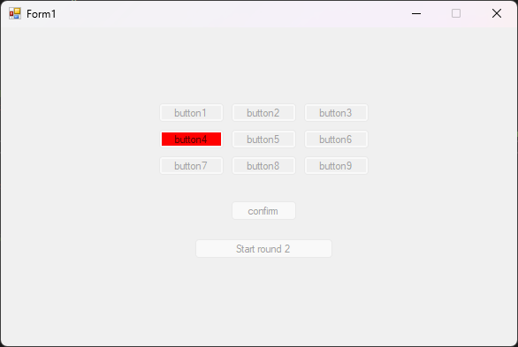

# Guessing Buttons Forms

This repository contains one of my first Windows.Forms projects, called "Guessing Buttons Forms." The main goal of this project was to learn how to keep the Form responsive. Looking back, I can already identify some flaws in the code. For example, invoking 'ActiveForm' throws an exception if the user has focused on another window.

# How to play?

1. Run the application.
2. Press the "Start" button.
3. Four buttons will highlight one by one in a precalculated random order.
4. Repeat the order by clicking on the buttons in the same order.
5. After repeating the order, press the "Confirm" button.
6. If you lose, you will hear a sound indicating your failure.
7. If you win, the Form will go crazy and flash different colors.
8. Each round decreases the delay between button highlighting, making it more challenging.

# Future Refactoring Plans

As of now, there are no plans to refactor this project. It was one of my early projects, and despite recognizing flaws in the code, I intend to keep it as it is. It serves as a reminder of my learning journey and progress.

Feel free to explore and enjoy the game! If you have any questions or suggestions, please let me know.

#
<h6>Credits to GPT - OpenAI for assisting in crafting the readme</h6>